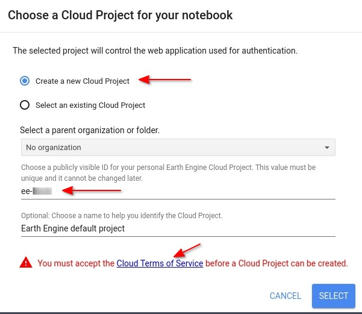
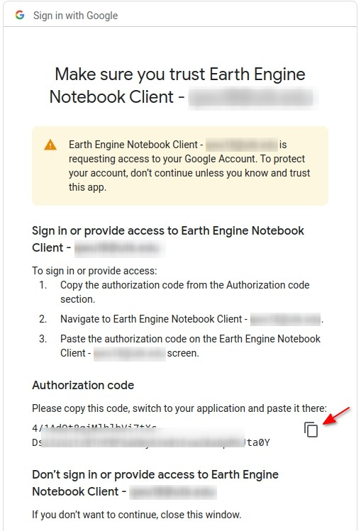
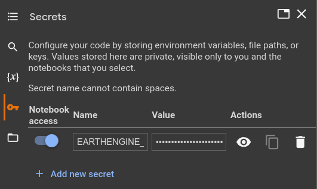

# Autenticação do Earth Engine

É necessário autenticar o `Earth Engine` antes de usá-lo. O pacote para a API Python do Earth Engine é chamado `earthengine-api`, que deve ter sido instalado automaticamente pelo pacote `geemap`, mas lembre-se que para usar com o Google Colab, não é necessário instalar esses pacotes. O script abaixo é necessário ser executado sempre que for iniciar um notebook Jupyter:
```
import ee
ee.Authenticate()
```
Depois de executar o script acima, uma nova aba será aberta no navegador pedindo que você faça login na sua conta do Earth Engine (note que o seu login gmail funciona !). Após o login, você será solicitado a autorizar o Google Earth Engine Authenticator. Se esta for a primeira vez que você está autenticando o Earth Engine, clique em ESCOLHER PROJETO para selecionar um projeto na nuvem a ser usado pelo Earth Engine (Figura 1 abaixo).<br>
<center>)</center>

Você pode escolher um projeto na nuvem existente ou criar um novo. Se optar por criar um novo projeto na nuvem, insira um nome para o projeto, por exemplo, **ee-seu-nome-de-usuario**, e clique no botão azul **SELECIONAR** para criar um novo projeto na nuvem. Se aparecer uma mensagem de aviso em vermelho na parte inferior da página, clique no link dos Termos de Serviço da Nuvem para aceitar os termos de serviço e, em seguida, clique no botão **SELECIONAR** novamente (veja a Figura 2 abaixo).<br>
<center></center>

Após selecionar um projeto na nuvem, clique no botão **GERAR TOKEN** para gerar um novo token. Você será solicitado a escolher sua conta do Earth Engine para o Notebook Client (Figura 3, abaixo).<br>
<center></center>

Clique no botão **Permitir** para permitir que o Notebook Client acesse sua conta do Earth Engine (Figura 4, abaixo).<br>
<center></center>

Um código de autenticação será gerado e exibido na página. Copie o código de autorização e cole-o na célula do notebook que solicita o código de verificação. Pressione Enter, e a mensagem **Token de autorização salvo com sucesso** deverá aparecer abaixo do código de autorização que você inseriu (Figura 5).<br>
<center></center>

Parabéns! Você autenticou com sucesso o Earth Engine para uso em seu notebook Jupyter. Em geral, a autenticação para instalações locais é uma etapa única que gera um token de autorização persistente armazenado em um computador local. O token pode ser encontrado no seguinte caminho de arquivo, dependendo do seu sistema operacional. Observe que você pode precisar mostrar os diretórios ocultos no seu computador para ver a pasta `**.config**` no diretório inicial.
```
Windows: C:\\Users\\USERNAME\\.config\\earthengine\\credentials
Linux: /home/USERNAME/.config/earthengine/credentials
MacOS: /Users/USERNAME/.config/earthengine/credentials
```
Depois que o Earth Engine estiver autenticado, você poderá executar o seguinte script para inicializar o Earth Engine em uma nova sessão do Python.
```
ee.Initialize()
```
Em geral, você precisará inicializar o Earth Engine para cada nova sessão do Python, ou seja, sempre que abrir um notebook Jupyter ou script Python e quiser usar o Earth Engine. Felizmente, o `geemap` pode inicializar automaticamente o Earth Engine para você ao criar um mapa interativo, o que será abordado no próximo capítulo. Em outras palavras, você raramente precisará executar `ee.Initialize()` explicitamente.

## Gravando o seu token como uma *SECRET*

O Google Colab permite que você grave a sua token associada à sua conta, de forma que facilite o processo de autenticação. Primeiro, localize sua Earth Engine Token no seu computador, conforme foi mostrado acima (o seu `**.config**`, que vai depender se você está usando Windows, Linux ou MacOS). Abra o arquivo de credenciais e copie todo o conteúdo para a área de transferência. **Nota importante**: Certifique-se de <u>**não compartilhar**</u> o conteúdo do arquivo de credenciais com outras pessoas para evitar acesso não autorizado à sua conta do Earth Engine. Agora siga esses passos:
- Abra seu notebook do Google Colab e clique na aba **SECRETS** (a pequena chave da aba do lado esquerdo).
- Crie um novo segredo com o nome **EARTHENGINE_TOKEN**.
- Cole o conteúdo da área de transferência na caixa de entrada de **Valor** do segredo criado.
- Ative o botão à esquerda para permitir que o notebook acesse o segredo.<br>
<center>)</center>

Pronto ! Se você seguiu todos esses passos, já está pronto para usar o GEE.
