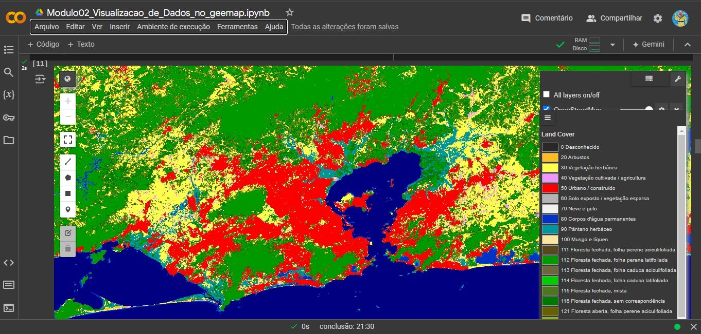

# Curso Básico de Google Earth Engine no Python (usando o Google Colab)

  

Este curso foi construído **INTEGRALMENTE** para iniciantes, usando o [Google Colab](https://colab.research.google.com/) e o poder do Google Earth Engine "em python". Ele foi baseado no trabalho do prof. [Qiusheng Wu](https://www.linkedin.com/in/giswqs/), originalmente publicado no [workshop SatMOC 2024](https://geemap.org/workshops/SatMOC_2024) usando o [Google Earth Engine](https://earthengine.google.com) e o [`Geemap`](https://geemap.org), mas adaptados à *realidade brasileira*, em especial, algumas ausências em produtos de seca, aspectos regionais do Brasil, e datasets mais interessants localmente. Caso você queira executar os notebooks localmente, todo o material pode ser usado em uma *environment* preparada com o `geemap` e o `ee`, e considera que você já tem o seu projeto definido no [Console do Google Cloud](https://console.cloud.google.com/). Fique atento que o documento [`EE_Authentication.md`](EE_Authentication.md) fala um pouco mais sobre o processo de autenticação. No início de cada notebook, vamos apontar para os requisitos básicos que você necessita, mas os passos de instalação local não são cobertos por este curso. 

**Nota importante 1**: Por conta da renderização dos notebooks no github, você não verá nenhum mapa aqui no github. Eles aparecem apenas quando você abre e executa os notebooks no seu ambiente.
**Nota importante 2**: Este curso é **B-Á-S-I-C-O** e foi desenvolvido para *quebrar o gelo* e tirar você da inércia. Aqui você pode desenvolver habilidades no GEE rapidamente, e o céu é o limite ! Use sua imaginação e criatividade !

Este curso foi elaborado considerando especificidades locais no Brasil, mas segue a mesma sequência apresentada pelo Prof. Qiusheng Wu seguindo o [webinar do Comitê de Meteorologia, Oceanografia e Climatologia de Satélites (SatMOC)](https://geemap.org/workshops/SatMOC_2024) da Sociedade Meteorológica Americana (AMS). Aqui vamos explorar os mesmos recursos do curso, mas no Brasil !

## Para saber mais ... um pouco de ciência

Períodos de seca representam uma ameaça crítica aos recursos hídricos, à agricultura e aos ecossistemas, e afetam profundamente a sociedade humana, e a ideia contida nestes notebooks é explorar o poder do Google Earth Engine (GEE) para monitorar e analisar padrões climáticos em um ambiente delimitado, focado na produção de mapas e nas séries temporais. O vasto repositório de dados de satélite, dados de modelos climáticos, análises e datasets combinados, todos contidos no GEE como *assets*, além dos recursos de computação em nuvem, permitem rapidamente construi mapas e realizar análises complexas em uma determinada região à sua escolha. Aqui, estes recursos serão utilizados de forma sequencial para permitir que você desenvolva suas habilidades de pesquisa sobre clima e eventualmente auxiliar na tomada de decisões, caso você esteja trabalhando com análise de dados em um determinado problema. Objetivamente, este curso está dividido em módulos que irão focar em: 
- 🌍 Explorar os fundamentos do sensoriamento remoto para monitoramento ambiental.
- 💻 Demonstrar técnicas de codificação no Google Earth Engine (GEE) para processar grandes conjuntos de dados geoespaciais.
- 📊 Criar visualizações dinâmicas que acompanham a evolução das condições de seca (ou chuva) ao longo do tempo.
- 📈 Entender o cálculo e a interpretação dos principais índices de seca, como o Palmer Drought Severity Index (PDSI) e o Standardized Precipitation Index (SPI).
- 🛠️ Desenvolver ferramentas para apoiar estratégias locais e regionais de gestão de recursos hídricos.

## O que você precisa saber "antes" de começar

É recomendado que você tenha *algum* conhecimento básico de Python 🐍 e aprenda a usar o Jupyter Notebook corretamente. Um aspecto muito importante é *saber usar o markdown* para fazer suas anotações, pois elas serão muito úteis para vocẽ. Para usar o geemap e a API Python do Earth Engine, você também precisa se registrar em uma conta do Earth Engine e seguir as instruções aqui para criar um projeto em nuvem. O Earth Engine é gratuito para uso não comercial (🚫💰💀!) e de pesquisa 📊. Para testar se você pode já pode usar a autenticação da API Python do Earth Engine, execute o notebook `0_teste_earthengine.ipynb` no Google Colab. Você tém pode seguir as instruções [aqui](EE_Authentication.md) para se registrar inicialmente.  Não é necessário ter familiaridade com a API JavaScript do Earth Engine, mas será útil se você quiser se aprofundar mais. A vantagem do Google Colab é que você não precisa instalar nada em no seu computador. Porém, se o seu objetivo é esse, basta você garantir que tem tudo instalado. Também recomendamos você usar a IA *Gemini* 🤖 que tem instalada no Google Colab pois ela facilita muito o processo de construção de códigos. 

Ao final deste curso, você estará equipado com as habilidades e os recursos necessários para integrar com segurança o Google Earth Engine em seus fluxos de trabalho de monitoramento ambiental e processos de tomada de decisão.

## Como este curso está dividido

O curso consiste em cinco módulos que podem ser completados em menos de 30 minutos (!) Porém, é aconselhável que vocẽ dedique um pouco mais de tempo à cada um deles. Durante cada módulo prático, você verá exemplos de notebooks Jupyter no Google Colab focados em regiões que vão desde uma pequena unidade de conservação, até um bioma inteiro, e no final de cada notebook, há sempre uma proposta um exercício prático para aplicar o conhecimento aprendido em cada módulo. Não desista na primeira falha ! É normal que códigos falhem e isso faz parte da construção da sua habilidade 💪.

- **[Módulo 1](https://github.com/andrebelem/Curso_Basico_Geemap/blob/main/Modulo01_Introducao_ao_geemap.ipynb)**: Introdução ao curso e configuração do `geemap` e `ee` no ambiente Jupyter 
    - Introdução ao Earth Engine e geemap
    - Autenticação da API Python do Google Colab e do Earth Engine
    - Usando dados do Earth Engine
    - Tipos de dados do Earth Engine
    - Catálogo de dados do Earth Engine
    - Exercício: criando imagens sem nuvens
- **[Módulo 2](https://github.com/andrebelem/Curso_Basico_Geemap/blob/main/Modulo02_Visualizacao_de_Dados_no_geemap.ipynb)**: Visualização de dados do Earth Engine
    - Ferramenta Geemap Inspector, ferramenta de plotagem, GUI interativa para visualização de dados
    - Legendas, barras coloridas e rótulos
    - Mapa de painel dividido e mapas vinculados
    - Inspetor de série temporal e controle deslizante de tempo
    - Exercício: visualizando séries temporais de precipitação e dados de vegetação
- **[Módulo 3](https://github.com/andrebelem/Curso_Basico_Geemap/blob/main/Modulo03_Animacoes_de_timelapse.ipynb)**: Criação de animações de timelapse
    - Estrutura de um timelapse
    - Timelapse do Landsat
    - Timelapse do Índice de Vegetação do MODIS
    - Timelapse do Sentinel
    - Exercício: criando animações de timelapse
- **[Módulo 4](https://github.com/andrebelem/Curso_Basico_Geemap/blob/main/Modulo04_Monitoramento_de_seca.ipynb)**: Monitoramento de seca
    - Explorando conjuntos de dados de seca
    - Criação de animações de série temporal de seca
    - Computando estatísticas zonais
    - Criação de gráficos interativos
    - Exercício: visualizando dados de seca para uma região selecionada
- **[Módulo 5](https://github.com/andrebelem/Curso_Basico_Geemap/blob/main/Modulo05_Analise_de_Dados_de_Precipitacao.ipynb)**: Análise e visualização de dados de precipitação
    - Explorando conjuntos de dados de precipitação
    - Criando séries temporais de precipitação
    - Cálculo do Índice de Precipitação Padronizado (SPI)
    - Exercício: calculando o SPI para uma região selecionada

Sinta-se livre para solicitar um *pull request* se você encontrar algum problema, e também se tiver alguma sugestão. Se você tiver dúvidas sobre o material contido aqui, pode escrever para [andrebelem@id.uff.br](andrebelem@id.uff.br).

  

  
